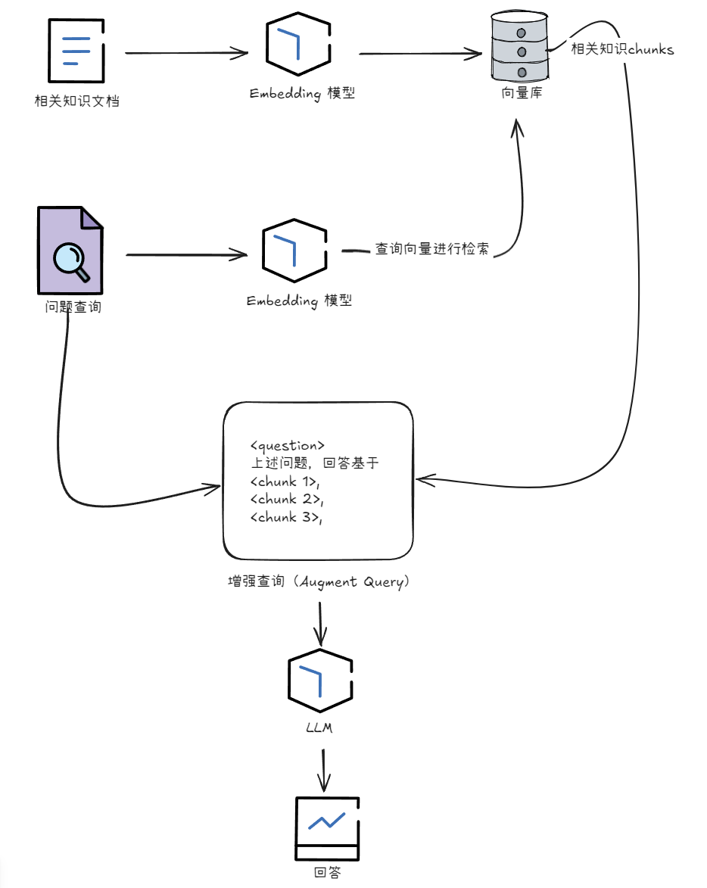

# Zero RAG

简易 RAG 流程实现。

## 使用
添加一个 .env 文件
```
OPENAI_API_BASE = "https://api.deepseek.com/v1"
OPENAI_API_KEY = "sk-yourapikeyhere"
PDF_PATH = "C:\\Users\\DiomChen\\Downloads\\test.pdf"
```

## rag 步骤


1. 文件切割与向量化
2. 向量库检索
3. 生成新的查询（问题+知识）
4. 通过 LLM 生成回答